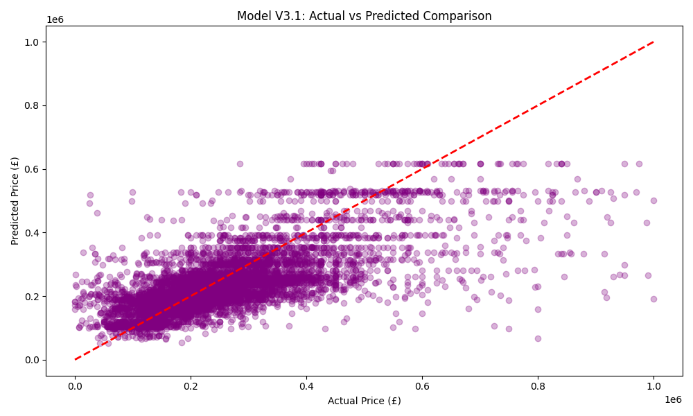

# 🏘️ Birmingham House Price Predictor (2024-2026)

This project is a comprehensive Machine Learning pipeline designed to predict property prices in Birmingham using real-world **HM Land Registry** data. It demonstrates a complete data science workflow, focusing on **Iterative Model Optimization** and **Diagnostic-Driven Feature Engineering**.

## ⚖️ Data Attribution & License
**Contains HM Land Registry data © Crown copyright and database right 2021. This data is licensed under the Open Government Licence v3.0.**

* **Permitted Use**: This data is used for non-commercial purposes to provide residential property price information services.
* **Address Data**: Contains address data processed against Ordnance Survey’s AddressBase Premium and Royal Mail’s PAF® database.
* **Compliance**: Use of this data adheres to the terms of the Open Government Licence (OGL) v3.0.

---

## 📈 Model Evolution: From Noise to Signal

The core value of this project is the documented transition from a failed baseline to a logical, signal-driven model.

### 1. Version 1: The Raw Baseline (Failed)
* **Status**: Significant Underperformance ($R^2 < 0$).
* **Diagnosis**: The model was overwhelmed by **extreme outliers** (luxury properties over £30M) and a heavily skewed price distribution.
* **Result**: 

  

### 2. Version 2: The Overfitting Trap
* **Observation**: After filtering properties $\le$ £1M and applying log-transformation, the $R^2$ improved to 0.38, but **`Month`** unexpectedly became the top predictor (Importance > 0.20).
* **Diagnosis**: The model was "memorizing" seasonal noise or specific transaction timing instead of learning real economic value.
* **Feature Importance (Bias):**

  

### 3. Version 3.1: Optimized Logic (Final Success)
* **Improvements**: 
    * **Composite Target Encoding**: Created `Area_Type_Avg` (Postcode + Property Type) to act as a powerful proxy for house size and location value.
    * **Noise Reduction**: Completely removed the `Month` variable to eliminate temporal bias.
    * **Complexity Control**: Restricted `max_depth` to 10 to ensure the model generalizes well on unseen 2025 data.
* **Result**: Successfully boosted **$R^2$ to 0.4624**. The feature importance now correctly aligns with economic reality, with our engineered feature dominating the prediction.

**V3.1 Feature Importance (Validated Logic):**

  

**V3.1 Prediction Accuracy:**

  

---

## 🛠️ Technical Implementation & Structure
* **Data Cleaning**: Focused on the mainstream market ($\le$ £1,000,000).
* **Target Scaling**: Applied **Log-transformation** (`np.log1p`) to normalize price distributions.
* **Robustness**: Used `.copy()` during data filtering to ensure data integrity and avoid `SettingWithCopy` warnings.

---

## 🚀 Future Work
* **EPC Data Integration**: Currently, the model is limited by the lack of physical dimensions. The next step is to merge **Energy Performance Certificate (EPC)** data to include **Total Floor Area** as a primary feature.
* **Hyperparameter Tuning**: Implementing automated search (e.g., GridSearchCV) once physical features are integrated.

---