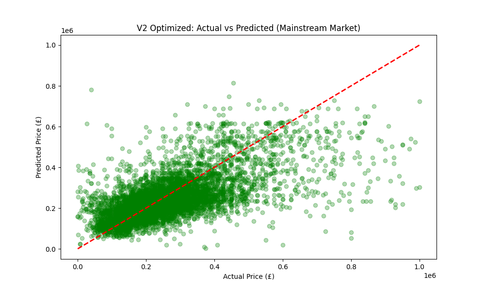
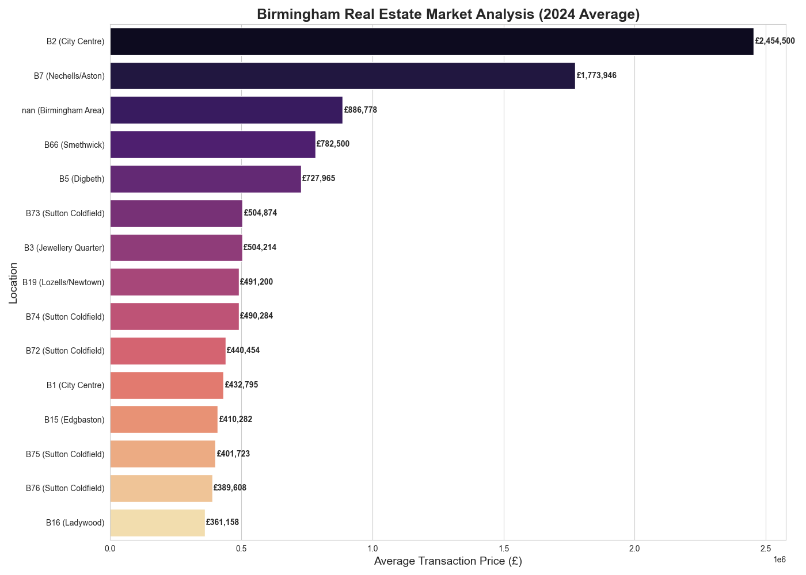

# 🏘️ Birmingham House Price Predictor (2024-2026)

This project is a comprehensive Machine Learning pipeline designed to predict property prices in Birmingham using real-world **HM Land Registry** data. It demonstrates a complete data science workflow, from handling large datasets to diagnostic-driven model optimization.

## 🌟 Project Highlights
- **Real-World Data**: Processed 100k+ records from the UK Price Paid Dataset.
- **Diagnostic-Driven**: Documented the evolution from a failed baseline to a functional predictive model.
- **Local Insights**: Mapped postcodes to specific Birmingham districts (e.g., Edgbaston, Selly Oak) for enhanced market analysis.

---

## 📈 Model Evolution & Performance

One of the key learning points in this project was the importance of **Feature Engineering** and **Data Cleaning** over model complexity.

### Version 1: Initial Baseline (Failed)
- **Status**: Underperformed ($R^2$: -0.09).
- **Observation**: The model failed significantly because it was skewed by extreme **outliers** (luxury properties over £30M) and a non-normal price distribution.

  
   
  <em>Figure 1: Initial model skewed by extreme outliers.</em>

### Version 2: Optimized Model (Current)
- **Improvements**:
  - **Outlier Filtering**: Capped property prices at £1M to focus on the mainstream residential market.
  - **Target Transformation**: Applied **Log-transformation** (`np.log1p`) to the price variable to normalize the distribution.
- **Result**: Successfully achieved a positive correlation with **$R^2$: 0.385** and a lower MAE.

  
   
  <em>Figure 2: Optimized model showing better alignment after log-transformation.</em>

---

## 📊 Birmingham Market Insights
The project visualizes the price disparity across Birmingham districts using 2024 transaction data.

- **Premium Areas**: **Edgbaston (B15)** and **Harborne (B17)** remain the most expensive residential areas.
- **Student Hubs**: **Selly Oak (B29)** shows moderate price levels, reflecting its high density of student accommodation.

  

---

## 🛠️ Tech Stack & Skills
- **Languages**: Python (Pandas, Scikit-learn, Seaborn, Matplotlib).
- **Core Concepts**: Regression, Outlier Analysis, Feature Engineering (One-Hot Encoding, Log-transform).

---